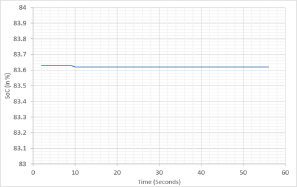
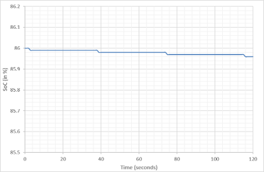
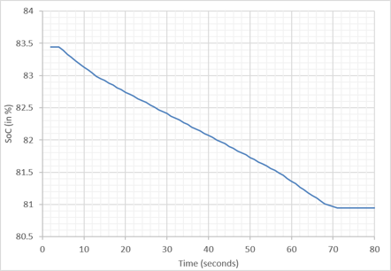

# Real-Time Li-Ion Battery SOC Estimation using EKF

# Li-Ion Battery SOC Estimation using EKF

An ESP32-based real-time State of Charge (SOC) estimation system for a Lithium-ion battery using Coulomb Counting, an OCV-SOC lookup table, and an Extended Kalman Filter (EKF).

---

## Overview

State of Charge (SOC) indicates the amount of charge remaining in a battery.

Accurate SOC estimation is an important part of a Battery Management System (BMS), especially in applications such as Electric Vehicles (EVs).

This project implements a real-time SOC estimation system using an ESP32 microcontroller. Battery voltage and current are measured in real time and processed using an Extended Kalman Filter.

The system combines:

- Coulomb Counting for SOC prediction
- Battery voltage measurement using the ESP32 ADC
- INA219 current sensing
- An experimentally obtained OCV-SOC lookup table
- EKF-based correction of the predicted SOC

The system was tested under no-load, LED-load, and DC-motor-load conditions.

---

## Why This Project?

Common SOC estimation methods have some limitations.

### Coulomb Counting

Coulomb Counting estimates SOC by integrating the current flowing into or out of the battery.

Although it is simple to implement, measurement errors can accumulate over time.

### Open Circuit Voltage (OCV)

OCV-based estimation uses the relationship between battery voltage and SOC.

However, battery voltage depends on the operating condition and the OCV-SOC relationship of the particular battery.

### Proposed Approach

This project combines Coulomb Counting with voltage-based correction using an Extended Kalman Filter.

The Coulomb Counting method provides the SOC prediction, while the measured battery voltage is used to correct the prediction.

---

## What Does the System Do?

The system performs the following steps:

1. Measures battery voltage using the ESP32 ADC.
2. Measures battery current using the INA219 sensor.
3. Calculates the elapsed time between measurements.
4. Predicts SOC using Coulomb Counting.
5. Obtains the expected battery voltage from the OCV-SOC lookup table.
6. Calculates the voltage innovation.
7. Calculates the Kalman Gain.
8. Corrects the predicted SOC using the EKF.
9. Continuously displays the battery parameters through the Serial Monitor.

---

## System Flow


---

## Hardware Used

| Component | Purpose |
|---|---|
| ESP32 | Main microcontroller |
| INA219 | Battery current measurement |
| 18650 Li-ion cell | Battery under test |
| 10 kΩ + 10 kΩ resistors | Voltage divider for battery voltage measurement |
| LED + 100 Ω resistor | Low-current test load |
| DC motor | Higher-current test load |

### Hardware Setup

The prototype was assembled on a breadboard using the ESP32, INA219 current sensor, voltage-divider circuit, Li-ion battery and different loads.


---

## Software Used

- Arduino IDE
- ESP32 Arduino Core
- Embedded C/C++

### Required Library

The project uses the Adafruit INA219 library.

Main libraries used in the firmware:

```cpp
#include <Arduino.h>
#include <Wire.h>
#include <Adafruit_INA219.h>
```

---

## Methodology

The SOC estimation process consists of a prediction stage and a correction stage.

### 1. SOC Prediction using Coulomb Counting

The predicted SOC is calculated using the measured battery current and elapsed time:

```text
SOC_pred = SOC_previous - (I × dt / Q) × 100
```

Where:

- `I` = battery current
- `dt` = elapsed time in hours
- `Q` = battery capacity
- `SOC_pred` = predicted SOC

The predicted SOC is used as the input to the EKF correction stage.

---

### 2. Battery Voltage Measurement

Battery voltage is measured through a 10 kΩ / 10 kΩ voltage divider connected to the ESP32 ADC.

The voltage divider reduces the battery voltage before it reaches the ADC.

The firmware reconstructs the battery voltage using the divider ratio and an empirical calibration factor.

To reduce ADC measurement fluctuations, the firmware takes multiple ADC samples and calculates their average.

---

### 3. OCV-SOC Lookup Table

An experimentally obtained OCV-SOC relationship is stored in the firmware as a lookup table.

The lookup table contains SOC and corresponding OCV values.

Linear interpolation is used to estimate:

```text
OCV → SOC
```

and

```text
SOC → OCV
```

This allows the estimated SOC to be converted into an expected battery voltage.

---

### 4. Predicted Battery Voltage

The predicted battery voltage is obtained from the OCV-SOC model.

The implementation also considers a voltage drop caused by battery current:

```text
V_est = OCV(SOC_pred) - I × R
```

where `R` is the resistance value used in the firmware.

---

### 5. EKF Correction

The difference between the measured voltage and predicted voltage is called the innovation:

```text
Innovation = V_measured - V_estimated
```

The Kalman Gain is calculated using:

```text
K = P × H / (H × P × H + R)
```

The SOC estimate is then corrected:

```text
SOC = SOC_pred + K × Innovation
```

The estimation error covariance is updated after the correction step.

This prediction-correction process is repeated continuously during operation.

---

## Real-Time Monitoring

The ESP32 sends the following parameters to the Serial Monitor:

```text
Voltage
Predicted Voltage
Voltage Innovation
Current
SOC
Kalman Gain
H
P
```

Serial Monitor baud rate:

```text
9600
```


---

## How to Use

### 1. Install Arduino IDE

Install the Arduino IDE and configure it for ESP32 development.

### 2. Install the Required Library

Install:

```text
Adafruit INA219
```

from the Arduino Library Manager.

### 3. Open the Firmware

Open:

```text
src/soc_ekf_esp32.ino
```

in Arduino IDE.

### 4. Select the ESP32 Board

Select the appropriate ESP32 board and COM port in Arduino IDE.

### 5. Check the Hardware Connections

Connect:

- Battery voltage divider to the ESP32 ADC
- INA219 to the ESP32 through I2C
- Battery and load according to the hardware configuration

### 6. Upload the Code

Compile and upload the firmware to the ESP32.

### 7. Open Serial Monitor

Open the Serial Monitor and set the baud rate to:

```text
9600
```

The system will begin measuring voltage and current and estimating SOC in real time.

---

## Experimental Testing

The prototype was tested under three different load conditions:

### No Load

With negligible current flow, the SOC remained almost constant during the observation period.

### LED Load

A low-power LED load produced a small discharge current, resulting in a gradual decrease in SOC.

### DC Motor Load

The DC motor produced a significantly higher current demand, resulting in a faster decrease in SOC.

---

## Results

| Load Condition | Mean Current | Mean SOC |
|---|---:|---:|
| No Load | -0.24 mA | 83.62 % |
| LED Load | 12.35 mA | 85.97 % |
| Motor Load | 676.39 mA | 81.86 % |

### No Load



### LED Load



### Motor Load



The experimental results show that the estimated SOC remains relatively stable under no-load conditions, decreases gradually under the LED load, and decreases more rapidly under the higher-current motor load.

---

## Limitations

This project is an experimental prototype and has the following limitations:

- The system is implemented for a single Li-ion cell.
- The OCV-SOC relationship is based on a specific battery characterization.
- EKF `Q` and `R` parameters are fixed during operation.
- Temperature effects are not included in the current model.

---

## Future Improvements

Possible improvements include:

- Adaptive EKF parameter tuning
- Temperature-dependent battery modeling
- Simultaneous SOC and SOH estimation
- Improved battery equivalent-circuit modeling
- Multi-cell BMS implementation
- CAN communication
- Wireless battery monitoring
- Testing under different temperatures and load conditions
- Validation using laboratory-grade battery testing equipment

---

## Applications

The concepts demonstrated in this project can be applied to:

- Battery Management Systems (BMS)
- Electric Vehicles (EVs)
- Battery monitoring systems
- Energy storage systems
- Embedded battery monitoring

---
